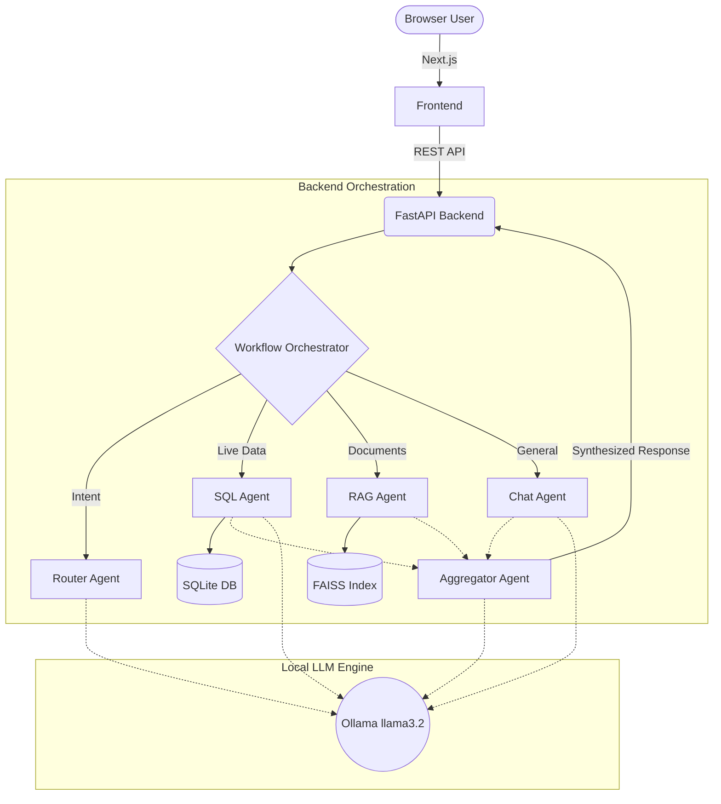

# Airport AI Platform


An enterprise-grade, AI-powered Airport Operations Monitoring Platform. This local-first, multi-agent system monitors live airport metrics and intelligently routes natural language queries to the correct data source, providing actionable insights for airport staff without relying on external cloud APIs.

---

## 📌 Project Overview

### Business Problem
Modern airports generate massive amounts of operational data (passenger flow, terminal temperatures, security wait times, runway statuses) and maintain vast libraries of procedural documents (Standard Operating Procedures, safety manuals). Staff typically have to navigate multiple legacy dashboards to find metrics and manually search through PDF documents for policy answers.

### The Solution
The Airport AI Platform unifies these workflows. Using a localized Large Language Model (llama3.2), the platform allows staff to ask natural language questions. A sophisticated multi-agent orchestration layer determines if the question requires live SQL data, semantic document retrieval (RAG), or both, and synthesizes a comprehensive response instantly.

---

## ✨ Features

- **Multi-Agent AI Orchestration:** Automatically routes questions to specialized agents (SQL, RAG, or Chat) based on semantic intent.
- **Natural Language to SQL:** Safely converts user queries into read-only SQL to fetch live operational metrics.
- **Privacy-Preserving RAG:** Vectorizes uploaded PDF manuals into FAISS indexes for lightning-fast, local semantic search without exposing internal policies to third-party APIs.
- **Real-Time Dashboards:** Displays live operational metrics across multiple airport zones (T1, T2, CNS, RWY, BHS, ATC).
- **Role-Based Access Control (RBAC):** Restricts data access and administrative features based on user roles (Admin, Analyst, Viewer).
- **Robust Security Guards:** Implements strict prompt injection defenses and data exfiltration blocks at the API layer.
- **100% Local Execution:** Powered by Ollama, ensuring zero data leakage to external LLM providers.

---

## 🏗 System Architecture

The platform follows a decoupled, containerized architecture.



### AI Workflows

1. **SQL Workflow:** If the user asks about live metrics (e.g., "What is the average security wait time in Terminal 1?"), the SQL Agent generates a safe, read-only query, executes it against SQLite, and returns the data.
2. **RAG Workflow:** If the user asks a procedural question (e.g., "What is the SOP for a baggage failure?"), the RAG Agent uses `sentence-transformers` to embed the query, searches the FAISS index for relevant chunks, and returns the exact policy excerpt.
3. **Hybrid Workflow:** Complex questions triggering both agents are executed in parallel, with the Aggregator Agent synthesizing the combined findings into a coherent response.

---

## 🔐 Authentication & RBAC

The system utilizes stateless JWT (JSON Web Tokens) for authentication.

| Role | Access Level | Capabilities |
|------|--------------|--------------|
| **Admin** | Full Access | Upload/delete KB documents, view raw SQL traces, view Service Status |
| **Analyst** | Standard | View dashboards, ask AI questions, view metrics |
| **Viewer** | Read-Only | View dashboards and metrics |

*Note: Default users are seeded upon initial startup (`admin`, `analyst`, `viewer`). Passwords must be changed in a production environment.*

---

## 📚 Knowledge Base Management

Administrators can upload PDF documents through the Knowledge Base interface.
1. **Extraction:** PyMuPDF extracts raw text.
2. **Chunking:** Text is split into overlapping chunks (Size: 500, Overlap: 50).
3. **Embedding:** `all-MiniLM-L6-v2` converts chunks to 384-dimensional vectors.
4. **Indexing:** Vectors are stored locally in FAISS for rapid retrieval.

---

## 💻 Technology Stack

| Layer | Technology | Justification |
|-------|------------|---------------|
| **Frontend** | Next.js 15, React, Tailwind CSS | Robust SSR, responsive UI, shadcn/ui components |
| **Backend** | FastAPI, Pydantic, SQLAlchemy | High-performance async API, strict data validation |
| **Database** | SQLite | Lightweight, zero-config relational storage |
| **LLM Engine** | Ollama (llama3.2) | Completely local, private, and highly capable |
| **Embeddings** | sentence-transformers | Fast, local, CPU-friendly embeddings |
| **Vector Store** | FAISS | Efficient similarity search |
| **Deployment** | Docker Compose | Isolated, reproducible environments |

---

## 📂 Folder Structure

```
airport-ai-platform/
├── backend/                  # FastAPI Application
│   ├── app/
│   │   ├── agents/           # LLM Agents (Orchestrator, Router, SQL, RAG, etc.)
│   │   ├── api/              # REST Endpoints
│   │   ├── auth/             # JWT & RBAC Logic
│   │   ├── database/         # SQLite Models & Initialization
│   │   ├── rag/              # Document Ingestion & FAISS search
│   │   ├── repositories/     # Data Access Layer
│   │   └── utils/            # Prompt Injection Sanitization
│   └── tests/                # Pytest Suite
├── frontend/                 # Next.js Application
│   ├── src/
│   │   ├── app/              # App Router Pages
│   │   ├── components/       # UI Components & Layouts
│   │   ├── lib/              # API Client Utilities
│   │   └── types/            # TypeScript Interfaces
├── docs/                     # Architecture & ADR Documentation
├── evaluation/               # AI Benchmark & Evaluation Strategy
├── data/                     # Persistent Docker Volumes (SQLite, FAISS, PDFs)
└── docker-compose.yml        # Orchestration Configuration
```

---

## 🚀 Installation & Running

### Prerequisites
- Docker Desktop (with Docker Compose v2)
- Minimum 8 GB RAM (Ollama + Application)

### Running with Docker (Recommended)

This single command builds the UI, the API, pulls the LLM, and initializes the database.

```bash
git clone https://github.com/gauravchauhan1035-cpu/airport-ai-platform.git
cd airport-ai-platform

# Copy the environment file
cp .env.example .env

# Build and start all services in detached mode
docker compose up -d --build
```
*Note: The first run will take a few minutes as the `airport-ollama-init` container downloads the `llama3.2` model weights.*

### API Endpoints & Interfaces

| Service | Local URL |
|---------|-----------|
| **Frontend App** | `http://localhost:3000` |
| **Backend API** | `http://localhost:8000` |
| **Swagger UI** | `http://localhost:8000/docs` |
| **Ollama Server** | `http://localhost:11434` |

### Running Locally (Without Docker)
If you prefer running outside Docker for active development:
1. Ensure Python 3.11+ and Node.js 20+ are installed.
2. Install and start [Ollama](https://ollama.com/) on your host machine and run `ollama run llama3.2`.
3. Backend:
   ```bash
   cd backend
   python -m venv venv
   source venv/bin/activate  # Windows: venv\Scripts\activate
   pip install -r requirements.txt
   uvicorn app.main:app --reload
   ```
4. Frontend:
   ```bash
   cd frontend
   npm install
   npm run dev
   ```

---

## ⚙️ Environment Variables

Located in `.env`:
- `SECRET_KEY`: JWT signing key.
- `DATABASE_URL`: Connection string (defaults to SQLite).
- `OLLAMA_BASE_URL`: Endpoint for local LLM (defaults to `http://ollama:11434`).
- `RAG_CHUNK_SIZE` / `RAG_CHUNK_OVERLAP`: Document splitting parameters.

---
---

## 🔮 Future Improvements

- **Agent Framework Migration:** Transition from custom orchestration to LangGraph or AutoGen for complex cyclical workflows.
- **Postgres/pgvector:** Migrate from SQLite/FAISS to PostgreSQL with `pgvector` for scalable, unified storage.
- **Streaming Responses:** Implement Server-Sent Events (SSE) for token-by-token streaming in the UI.
- **Advanced RAG:** Implement hybrid search (BM25 + Dense Vectors) and query reformulation.

---

## 🛠 Troubleshooting

**"Ollama connection refused"**
Ensure the `airport-ollama` container is running and healthy. Sometimes downloading the 2GB+ model times out on slow connections. Check logs using:
`docker compose logs -f airport-ollama-init`

**"SQL Agent returning empty results"**
Ensure your question maps to the actual schema available in the `operational_metrics` table (e.g., `temperature`, `passenger_count`).

---
*Private — All rights reserved. Gaurav Chauhan, 2026.*
