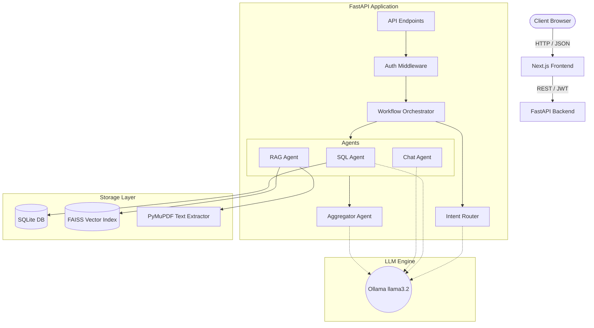

# System Architecture

The Airport AI Platform is designed as a decoupled, multi-container system. It uses a modern Next.js frontend to communicate with a high-performance FastAPI backend, which houses a specialized AI orchestration layer powered entirely by a local instance of Ollama (`llama3.2`).

## High-Level Architecture

## Request Workflows

### 1. Authentication Flow
1. User submits credentials to `/auth/login`.
2. Backend verifies bcrypt-hashed password against the `users` SQLite table.
3. Backend issues a JWT containing the user's ID and Role (Admin, Analyst, Viewer).
4. All subsequent API requests require this JWT in the `Authorization` header. Endpoints perform Role-Based Access Control (RBAC) verification before execution.

### 2. General AI Request Flow
1. User submits a natural language question via the UI.
2. The request hits the `/query` endpoint.
3. **Input Sanitization:** The endpoint checks `detect_prompt_injection` and `detect_data_exfiltration`. If malicious intent is detected, the request is instantly blocked.
4. The `WorkflowOrchestrator` fetches the user's conversation history from SQLite.
5. The request is passed to the **Intent Router**.

### 3. Intent Router Flow
The Intent Router (`llama3.2`) analyzes the user's question and conversation history to determine an execution plan. It outputs a strictly formatted JSON array of target agents:
- `["SQL"]`: For live metrics, averages, sensor readings.
- `["RAG"]`: For procedural, policy, and manual lookups.
- `["CHAT"]`: For general reasoning, greetings, and out-of-domain rejection.
- `["SQL", "RAG"]`: For complex queries requiring both current status and policy validation.

### 4. Agent Execution (Parallel)
The Orchestrator executes the selected agents concurrently using Python's `asyncio.gather`.

#### SQL Flow
1. Natural language question is sent to the SQL Agent.
2. The agent injects a read-only database schema into the prompt.
3. `llama3.2` generates a SQLite `SELECT` query.
4. Security validators ensure no DML/DDL commands, no system table access, and enforce a maximum row limit (20 rows).
5. Query is executed against SQLite, returning tabular data.

#### RAG Flow
1. Natural language question is sent to the RAG Agent.
2. The question is embedded using `all-MiniLM-L6-v2` (SentenceTransformers).
3. The resulting vector is queried against the FAISS index (Top-K = 5).
4. The retrieved text chunks are mapped back to their source document and page number.

#### Chat Flow
1. Question is sent to the Chat Agent.
2. The agent uses strict system prompts to maintain persona and politely reject hallucination attempts.

### 5. Aggregation Flow
1. If multiple agents were executed, all outputs (SQL tabular data, RAG document excerpts, Chat responses) are sent to the **Aggregator Agent**.
2. The Aggregator uses `llama3.2` to synthesize the raw data into a cohesive, natural language response for the user.
3. The final response is returned to the frontend and persisted to the `conversation_messages` table for memory context.

## Component Interaction & Guardrails

The architecture strictly separates the **routing logic** from the **execution logic** to prevent hallucination. 

By forcing the router to choose a specialized sub-agent, the platform ensures that the LLM writing the SQL query is not distracted by procedural document context, and the LLM synthesizing the final answer is shielded from the complexities of generating SQL. This "divide and conquer" approach maximizes the reasoning capabilities of smaller models like `llama3.2` while running on consumer hardware.
