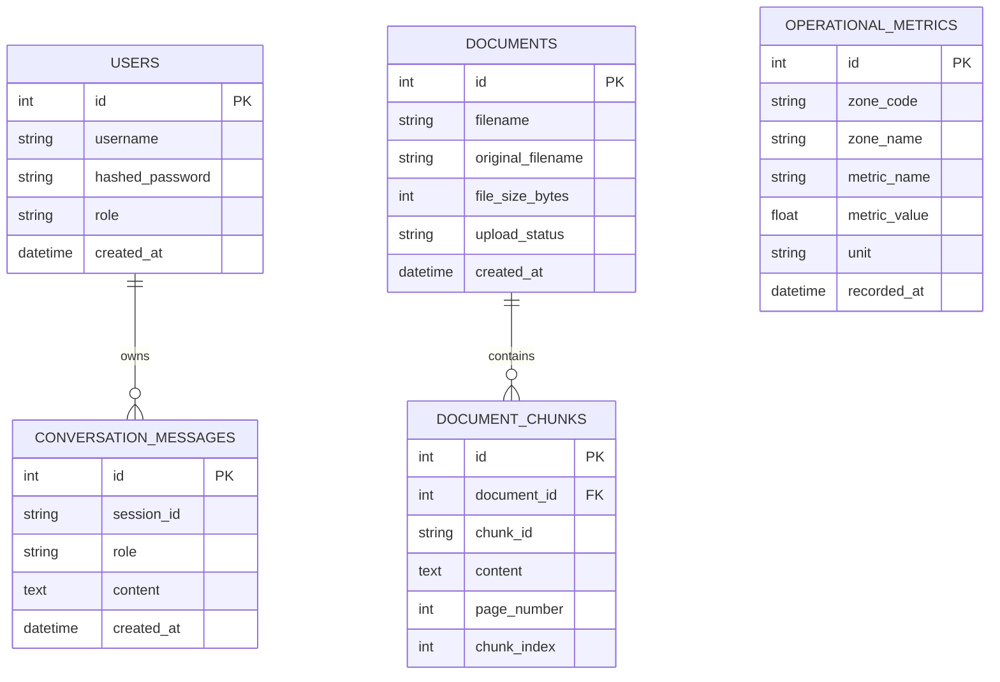

# Database Schema

The Airport AI Platform utilizes **SQLite** for relational data storage. The database manages user authentication, operational metrics (monitored by the SQL Agent), document metadata (monitored by the RAG Agent), and conversation memory.

## Schema Overview

---

## Tables in Detail

### 1. `users`
**Purpose:** Manages system access, authentication credentials, and Role-Based Access Control (RBAC).
**Used By:** Authentication System (`/auth`), API Middleware, Frontend UI.

| Column | Type | Constraints | Description |
|--------|------|-------------|-------------|
| `id` | Integer | Primary Key | Unique user identifier |
| `username` | String(50) | Unique, Index | User's login name |
| `hashed_password` | String | Not Null | Bcrypt hashed password |
| `role` | String(20) | Not Null | User role (`admin`, `analyst`, `viewer`) |
| `created_at` | DateTime | Default UTC | Account creation timestamp |

### 2. `operational_metrics`
**Purpose:** Stores live numerical sensor data and counts across various airport zones. This is the only table exposed to the AI SQL Agent.
**Used By:** SQL Agent, Dashboard API, Metrics API.

| Column | Type | Constraints | Description |
|--------|------|-------------|-------------|
| `id` | Integer | Primary Key | Unique reading identifier |
| `zone_code` | String(10) | Index | Abbreviated zone (e.g. `T1`, `RWY`, `CNS`) |
| `zone_name` | String(100) | Not Null | Full zone name |
| `metric_name` | String(50) | Index | Type of reading (e.g. `temperature`, `passenger_count`) |
| `metric_value` | Float | Not Null | The numeric value of the reading |
| `unit` | String(20) | Not Null | Unit of measurement (e.g. `C`, `count`, `%`) |
| `recorded_at` | DateTime | Default UTC, Index | When the reading occurred |

### 3. `documents`
**Purpose:** Tracks metadata for uploaded PDF manuals and standard operating procedures (SOPs).
**Used By:** Knowledge Base API, Document Repository.

| Column | Type | Constraints | Description |
|--------|------|-------------|-------------|
| `id` | Integer | Primary Key | Unique document identifier |
| `filename` | String(255) | Unique, Not Null | System-generated safe filename |
| `original_filename` | String(255) | Not Null | Original filename uploaded by user |
| `file_size_bytes` | Integer | Not Null | Size of the PDF file |
| `upload_status` | String(50) | Default 'processed' | Processing status |
| `created_at` | DateTime | Default UTC | Upload timestamp |

### 4. `document_chunks`
**Purpose:** Maps vectorized text chunks stored in FAISS back to their original document and page number for accurate citation generation.
**Used By:** RAG Agent, RAG Chunker.

| Column | Type | Constraints | Description |
|--------|------|-------------|-------------|
| `id` | Integer | Primary Key | Unique chunk mapping identifier |
| `document_id` | Integer | Foreign Key (`documents.id`) | Links to parent document |
| `chunk_id` | String(100) | Unique, Index | Matches FAISS index ID |
| `content` | Text | Not Null | Raw text string of the chunk |
| `page_number` | Integer | Not Null | Source page number in the PDF |
| `chunk_index` | Integer | Not Null | Sequential order of the chunk in the doc |

### 5. `conversation_messages`
**Purpose:** Provides a persistent memory layer allowing the AI agents to answer context-aware follow-up questions.
**Used By:** Workflow Orchestrator, Memory Service.

| Column | Type | Constraints | Description |
|--------|------|-------------|-------------|
| `id` | Integer | Primary Key | Unique message identifier |
| `session_id` | String(100) | Index | Associates message to a specific UI chat session |
| `role` | String(20) | Not Null | `user` or `assistant` |
| `content` | Text | Not Null | The actual message content / response |
| `created_at` | DateTime | Default UTC, Index | Message timestamp used for sorting |

---

## Architectural Usage Notes

### Isolation for SQL Agent
For security reasons, the SQL Agent is **only** provided the schema definition for the `operational_metrics` table via its system prompt. The prompt strictly instructs the LLM not to attempt querying any system tables or the `users` table.

### Relational / Vector Hybrid Storage
While `documents` and `document_chunks` exist in SQLite to handle relational mapping, metadata, and page citation tracking, the actual semantic search is performed over high-dimensional vector representations stored externally in the flat-file FAISS index (`/data/faiss/index.faiss`).
